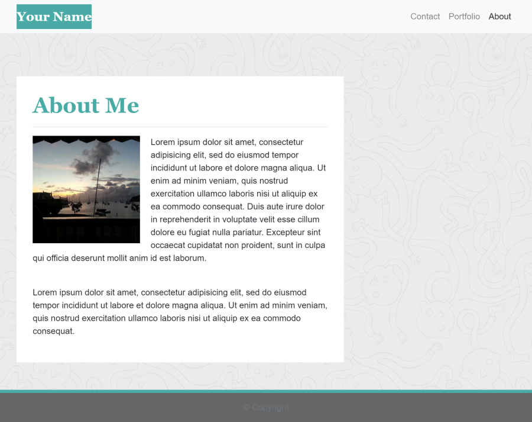

# 02-CSS-Bootstrap

## Description 

The Bootstrap portfolio should have the following criteria: 

   * Contain three pages: `index.html`, `portfolio.html` and `contact.html`
   
   * Have a navbar consistent on each page and with working links to About, Contact, and Portfolio pages

   * Use semantic html

   * Have A responsive layout

   * Responsive images

   * Have a sticky footer

## Installation

Click on this [link] or download the entire repository, unzip the files and double-click on `index.html` to see the page in an internet browser. 
Select a navigation item to see another page.  
**Note:** Preserve the folder structure if you download it.

## Images of a portfolio apparence  :mag_right:

## Credits

Icon made by Pixel perfect from https://www.flaticon.com/

## License

Copyright (c) [2020] [DT]. Everyone is permitted to use, copy, and modify verbatim copies of this document.

---
[link]: https://delph-sunny.github.io/02-CSS-Bootstrap/
